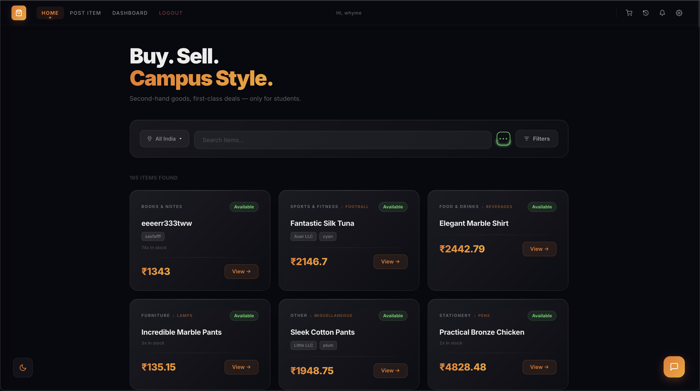
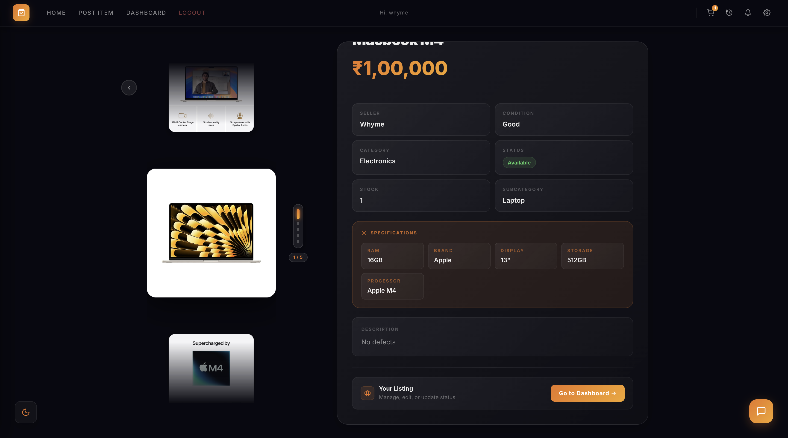
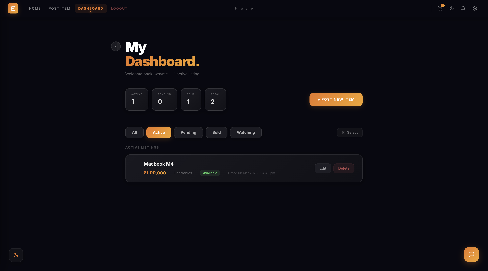
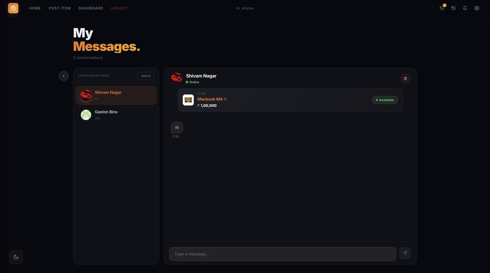
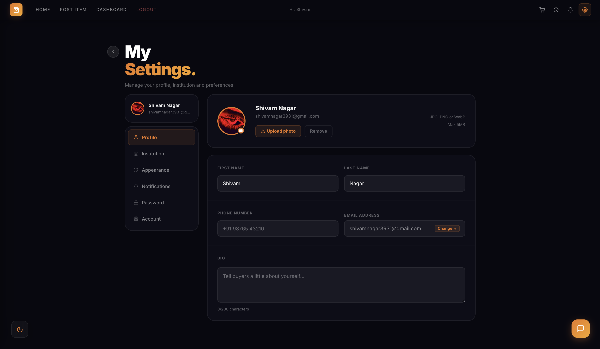
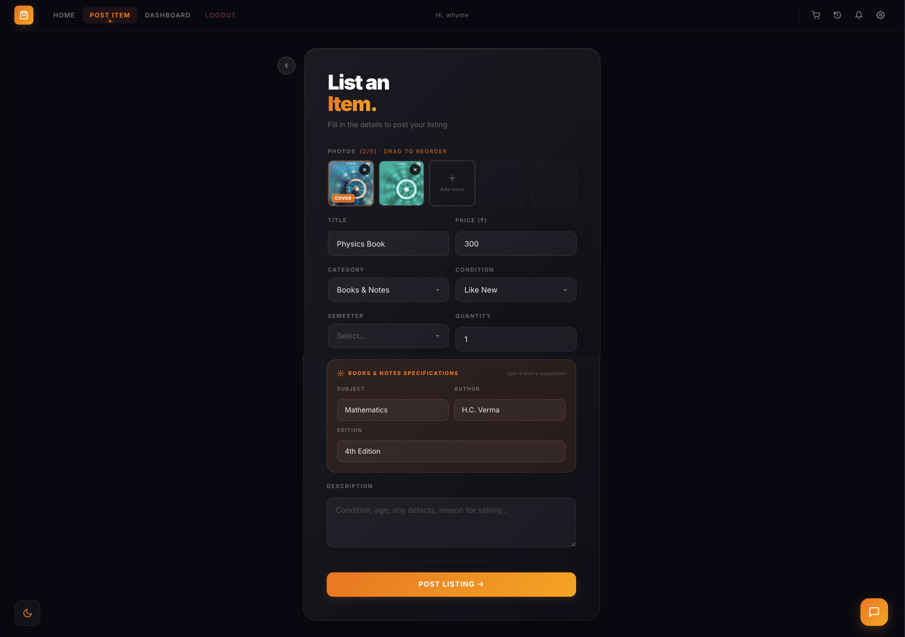
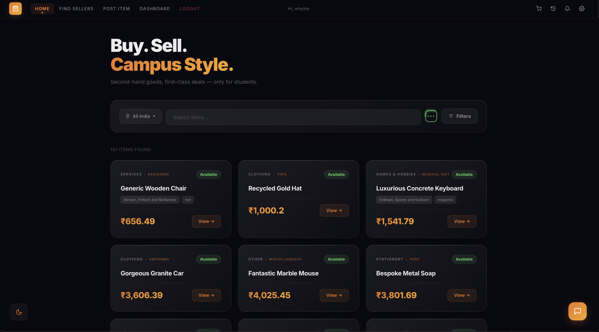
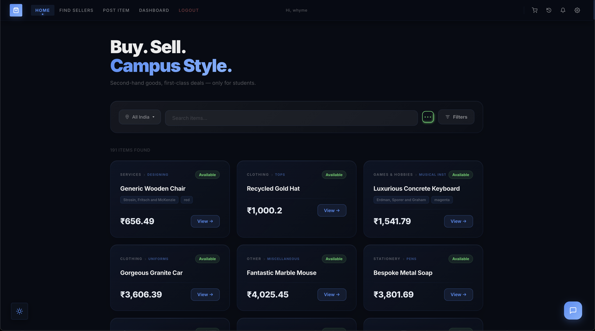
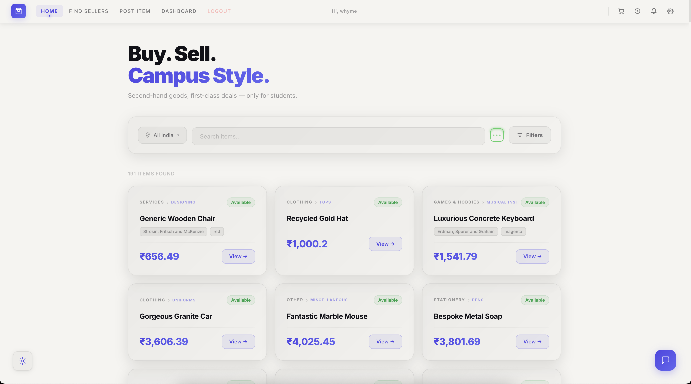

<div align="center">


<h1>Student Shop</h1>

<p><b>A peer-to-peer marketplace built exclusively for Indian students.</b><br/>
Buy and sell second-hand books, electronics, furniture and more —<br/>
with people from your own college or school.</p>

<br/>


<br/>

[](https://react.dev)
[](https://nodejs.org)
[](https://postgresql.org)
[](https://prisma.io)
[](https://cloudinary.com)

</div>

---

##  &nbsp; Screenshots

<div align="center">

| Home | Item Detail | Dashboard |
|:----:|:-----------:|:---------:|
|  |  |  |

| Messages | Settings | Post Item |
|:--------:|:--------:|:---------:|
|  |  |  |

</div>

---

##  &nbsp; Features

<table>
<tr>
<td width="50%">

** &nbsp; Live Search**<br/>
Filter by keyword, category, and institution in real time

** &nbsp; Solar Carousel**<br/>
Spring-animated 3D image viewer with infinite loop and zoom

** &nbsp; Messaging**<br/>
Direct conversations between buyers and sellers per listing

** &nbsp; Watch & Alerts**<br/>
Watch any item and get a real-time notification on price drops

</td>
<td width="50%">

** &nbsp; Live Notifications**<br/>
Sales and messages delivered instantly via WebSocket

** &nbsp; 3 Themes**<br/>
Ember · Midnight · Chalk, synced to your profile

** &nbsp; Flexible Auth**<br/>
Google OAuth or classic email + password, your choice

** &nbsp; 5000+ Institutions**<br/>
Every college and school across all Indian states

</td>
</tr>
</table>

---

##  &nbsp; Tech Stack

<div align="center">

|  | Frontend | Backend | Infra |
|--|----------|---------|-------|
| **Runtime** | React 18 + Vite | Node.js + Express | PostgreSQL |
| **Styling** | Tailwind CSS + CSS vars | — | Prisma ORM v7 |
| **Auth** | — | JWT (7d) + bcrypt | — |
| **OAuth** | — | Google auth-code flow | — |
| **Media** | — | Cloudinary | — |
| **Realtime** | Socket.IO client | Socket.IO server | — |
| **Routing** | React Router DOM | Express Router | — |
| **Security** | — | Helmet + rate-limit | — |

</div>

---

##  &nbsp; Project Structure

```
student-shop/
│
├── frontend/
│   └── src/
│       ├── pages/          ← Home, Login, Register, ItemDetail
│       │                      PostItem, Dashboard, Messages
│       │                      Transactions, Settings
│       ├── components/     ← Navbar, SolarCarousel, ThemeToggle
│       │                      LocationPicker, MessageButton
│       ├── context/        ← ThemeContext
│       ├── hooks/          ← useDraggable
│       ├── api/            ← Axios instance
│       └── index.css       ← CSS variables + all 3 themes
│
└── backend/
    ├── src/
    │   ├── controllers/    ← auth, users, items, messages
    │   │                      transactions, notifications, upload
    │   ├── routes/
    │   ├── middleware/     ← JWT auth
    │   ├── lib/            ← Prisma client
    │   └── data/           ← institutions.js (5000+ entries)
    │ 
    └── database/
        └── prisma/
            ├── schema.prisma
            └── migrations/
```

---

##  &nbsp; Database Schema

```
User           id · email · firstName · lastName · phone · avatar
               institution · institutionType · city · state
               theme · authProvider · profileComplete
               saleNotifications · messageNotifications · priceDropAlerts

Item           id · title · description · price · category · condition
               status · images[] · sellerId · sellerInstitution

Message        id · content · senderId · receiverId · itemId

Transaction    id · buyerId · sellerId · itemId · amount · status

Notification   id · userId · type · message · itemId · oldPrice · read

WatchedItem    userId · itemId
```

---

##  &nbsp; API Reference

<details>
<summary>&nbsp;<b>Auth</b></summary>

```
POST  /auth/register
POST  /auth/login
POST  /auth/google
```
</details>

<details>
<summary>&nbsp;<b>Users</b></summary>

```
GET    /users/me
PUT    /users/profile
PUT    /users/complete-profile
POST   /users/create-password
POST   /users/send-otp
POST   /users/change-email
POST   /users/change-password
POST   /users/reset-password
DELETE /users/account
```
</details>

<details>
<summary>&nbsp;<b>Items</b></summary>

```
GET    /items
GET    /items/:id
GET    /items/watched
POST   /items
PUT    /items/:id
PATCH  /items/:id/status
DELETE /items/:id
```
</details>

<details>
<summary>&nbsp;<b>Messages & Notifications</b></summary>

```
POST  /messages
GET   /messages/conversations
GET   /messages/:itemId
GET   /notifications
PATCH /notifications/read
```
</details>

<details>
<summary>&nbsp;<b>Upload</b></summary>

```
POST   /upload/avatar
DELETE /upload/avatar
POST   /upload/item-image
DELETE /upload/item-image
```
</details>

<details>
<summary>&nbsp;<b>Institutions</b></summary>

```
GET /institutions/search?q=&type=&limit=
GET /institutions/states
```
</details>

---

##  &nbsp; Getting Started

### Prerequisites
- Node.js 18+
- PostgreSQL running locally
- Cloudinary account — free tier, no credit card
- Google OAuth credentials from Google Cloud Console

---

### 1 &nbsp;·&nbsp; Clone

```bash
git clone https://github.com/your-username/student-shop.git
cd student-shop
```

### 2 &nbsp;·&nbsp; Database

```bash
cd database
npm install
npx prisma migrate dev
```

### 3 &nbsp;·&nbsp; Backend

```bash
cd backend
npm install
```

Create `backend/.env`:

```env
PORT=8000
DATABASE_URL=postgresql://your_user@localhost:5432/student_shop?schema=public
JWT_SECRET=your_64_char_random_hex

CLOUDINARY_CLOUD_NAME=
CLOUDINARY_API_KEY=
CLOUDINARY_API_SECRET=

GOOGLE_CLIENT_ID=
GOOGLE_CLIENT_SECRET=

FRONTEND_URL=http://localhost:5173
```

```bash
npm run dev
# → http://localhost:8000
```

### 4 &nbsp;·&nbsp; Frontend

```bash
cd frontend
npm install
```

Create `frontend/.env`:

```env
VITE_API_URL=http://localhost:8000
VITE_GOOGLE_CLIENT_ID=your_google_client_id
```

```bash
npm run dev
# → http://localhost:5173
```

> **Note:** Port 8000 instead of 5000 — macOS AirPlay blocks 5000.

---

##  &nbsp; Themes

<div align="center">

| Ember | Midnight | Chalk |
|:-----:|:--------:|:-----:|
|  |  |  |
| Dark · Glass · Orange/Gold | Dark · Sharp · Electric Blue | Light · Neumorphic · Indigo |

</div>

Themes switch via Settings → Appearance. Stored in `localStorage` + user DB profile. Applied via `data-theme` attribute on `<html>` using CSS custom properties — all components theme-aware with zero hardcoded colours.

---

##  &nbsp; Security

- **JWT** — tokens expire after 7 days
- **bcrypt** — passwords hashed with 12 salt rounds
- **CORS** — locked to frontend origin only
- **Rate limiting** — 2000 req / 15 min general · 10 req / 15 min on auth
- **Helmet** — secure HTTP headers on all responses
- **`.env`** — gitignored, never committed
- **OAuth users** — can create a password as a backup login method; `authProvider` field tracks `local` · `google` · `both`

---
